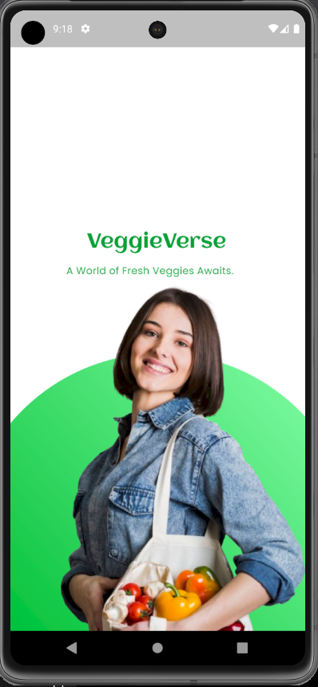
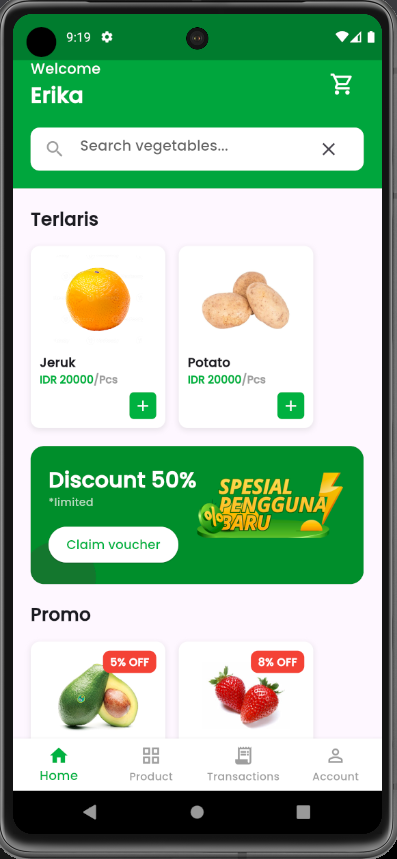
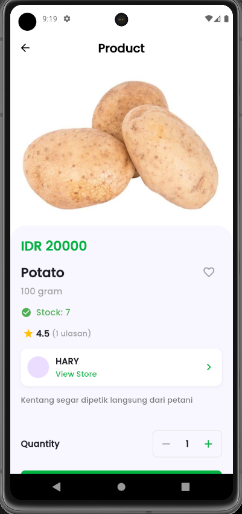
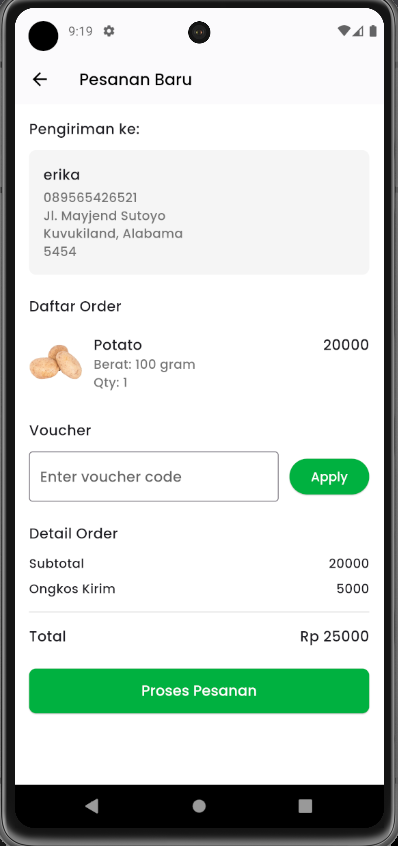
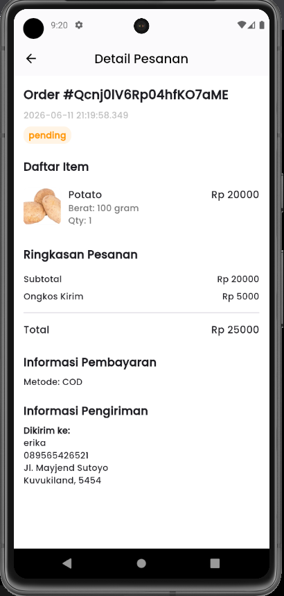
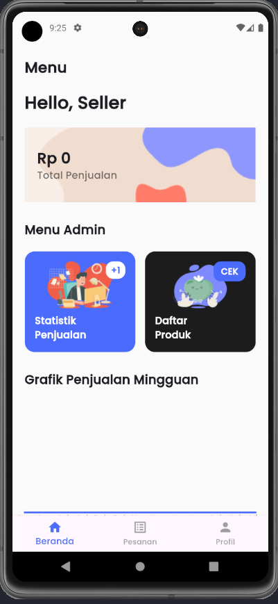

# 🥬 VeggieVerse

VeggieVerse is a Flutter-based vegetable marketplace application developed as a university final project. The application connects buyers and sellers through a mobile platform, enabling users to browse fresh vegetables, place orders, and manage products efficiently.

## ✨ Features

### Buyer Features

* User authentication using Firebase Authentication
* Browse available vegetable products
* View detailed product information
* Add products to cart
* Checkout and place orders
* View order details and status

### Seller Features

* Dedicated seller dashboard
* Manage and monitor products
* View incoming orders

## 🛠️ Tech Stack

* Flutter
* Dart
* Firebase Authentication
* Cloud Firestore

## 📸 Screenshots

### Splash Screen

### Home Page

Browse various vegetable products available in the marketplace.

### Product Detail

View detailed information about a selected product before purchasing.

### Checkout Page

Review selected items and proceed with the ordering process.

### Order Details

Track and review order information after placing an order.

### Seller Homepage

Seller dashboard for managing products and monitoring activities.

## 🚀 Getting Started

### Prerequisites

* Flutter SDK
* Android Studio or Visual Studio Code
* Firebase Project Configuration
